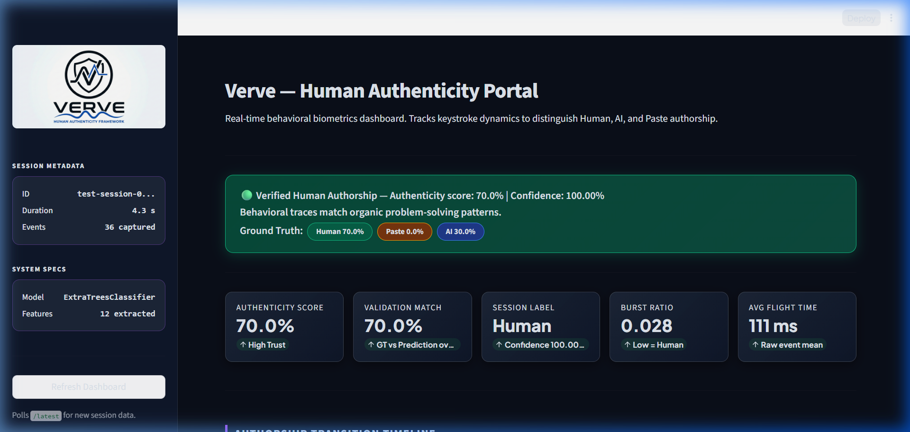

# 🛡️ Verve — Behavioral Biometrics & Authorship Verification System


**Project Verve** is a real-time behavioral biometrics system that passively monitors typing patterns inside VS Code and applies Machine Learning to distinguish whether code is being authored by a **Human developer**, inserted by **AI completion tools** (e.g., Copilot), or **Pasted from clipboard**.

---

## 📊 Dashboard Preview



---

## ✨ Key Features

- **Passive Biometric Tracking**: Captures sub-millisecond keystroke flight times, dwell times, cursor jumps, and insertion sizes without altering code files.
- **Tri-Class Authorship Detection**:
  - 🟢 **Human**: Natural, variable character-by-character typing rhythm.
  - 🔵 **AI Completion**: Instant multi-character block insertions with near-zero inter-key delays.
  - 🟠 **Paste**: Bulk content transfers verified against clipboard data.
- **Machine Learning Classification**: Sliding-window feature extraction analyzed by an ensemble classifier (`ExtraTreesClassifier` / `RandomForestClassifier`).
- **Interactive Authenticity Portal**: Streamlit-powered dashboard offering real-time transition timelines, window accuracy metrics, and biometric feature breakdown.
- **VS Code Extension**: Fully integrated sidebar webview to record, pause, and post sessions directly to the API backend.

---

## 🏗️ System Architecture

```
┌─────────────────────────────────────────────────────────┐
│              VS Code Extension (TypeScript)             │
│                                                         │
│  Developer types / AI inserts / pastes content          │
│         ↓ onDidChangeTextDocument                       │
│  TrackerService.ts                                      │
│  ├─ calculateDwellTime()  → Dwell duration (ms)         │
│  ├─ determineKeyType()    → Single / Bulk / Enter / BS  │
│  └─ determineSource()     → Human / AI / Paste / Unknown│
│         ↓ Stop & Post Session                           │
│  POST http://localhost:8000/process-session             │
└─────────────────────────────────────────────────────────┘
                          │
                          ▼
┌─────────────────────────────────────────────────────────┐
│              FastAPI Backend (Python)                   │
│                       main.py                           │
│                          ↓                              │
│              preprocess.py : process_session()          │
│  ├─ 1. Parse JSON payload into pandas DataFrame          │
│  ├─ 2. Sliding window segmentation (Size=40, Step=8)    │
│  ├─ 3. Extract 9 biometric features per window           │
│  ├─ 4. StandardScale & ML Model Inference               │
│  └─ 5. Cache result in memory                           │
└─────────────────────────────────────────────────────────┘
                          │
                          ▼
┌─────────────────────────────────────────────────────────┐
│           Streamlit Dashboard  (app.py)                 │
│  ├─ Live Session Metadata & Authenticity Score          │
│  ├─ Authorship Transition Timeline (Interactive plot)   │
│  ├─ Ground Truth vs ML Prediction Distribution          │
│  └─ Deep-Dive Biometric Features & Window Analysis      │
└─────────────────────────────────────────────────────────┘
```

---

## 📁 Repository Structure

```
verve/
├── app.py                      # Streamlit Authenticity Dashboard (Frontend)
├── requirements.txt            # Python dependencies
├── dashboard_preview.png       # Dashboard screenshot preview
├── verve_logo.png              # Project branding asset
├── verve_pipeline_documentation.md # Exhaustive pipeline specification
│
├── backend/                    # FastAPI Server & ML Models
│   ├── main.py                 # FastAPI application entry point
│   ├── preprocess.py           # Feature extraction & inference orchestration
│   ├── features_util.py        # Core feature mathematical transformations
│   ├── best_classifier.pkl     # Trained ML model weights
│   ├── scaler_cls.pkl          # Feature standard scaler
│   └── label_encoder.pkl       # Target label encoder
│
└── verve-project/              # VS Code Extension Source (TypeScript)
    ├── src/
    │   ├── extension.ts        # Extension activation & Webview controller
    │   └── TrackerService.ts   # Keystroke listener & biometric event builder
    ├── package.json            # Extension manifest
    └── tsconfig.json           # TypeScript configuration
```

---

## 🚀 Quickstart & Setup Guide

### 1. Prerequisites

- **Python**: `3.10` or higher
- **Node.js**: `v18.x` or higher & `npm`
- **VS Code**: `1.85.0` or higher

---

### 2. Environment Setup & Dependency Installation

Clone the repository and install the Python dependencies:

```bash
# Clone the repository
git clone https://github.com/syedwasi86/verve-project.git
cd verve-project

# (Optional) Create and activate a virtual environment
python -m venv .venv

# On Windows (PowerShell):
.\.venv\Scripts\Activate.ps1

# On macOS/Linux:
source .venv/bin/activate

# Install Python requirements
pip install -r requirements.txt
```

---

### 3. Running the FastAPI Backend Server

Launch the backend API server from the project root:

```bash
uvicorn backend.main:app --host 127.0.0.1 --port 8000 --reload
```

- **API Documentation (Swagger UI)**: `http://localhost:8000/docs`
- **Health Check**: `http://localhost:8000/health`

---

### 4. Running the Streamlit Authenticity Dashboard

Open a **second terminal** (with your virtual environment active) and run:

```bash
streamlit run app.py --server.port 8501
```

- **Dashboard Access**: `http://localhost:8501`

---

### 5. Running the VS Code Extension

1. Open the extension directory in VS Code or navigate via terminal:
   ```bash
   cd verve-project
   npm install
   npm run compile
   ```
2. Press **`F5`** inside VS Code (or select **Run Extension** from the Run & Debug menu).
3. A new **[Extension Development Host]** window will open.
4. Click on the **Verve Icon** on the Activity Bar.
5. Click **Start Tracking**, type code (or test pasting / AI insertions), click **Stop Tracking**, and finally **Post to Backend**.
6. Refresh or view the **Streamlit Dashboard** at `http://localhost:8501` to view your live authenticity analytics!

---

## 📡 API Specification

### `POST /process-session`
Processes a `VerveSession` JSON payload sent by the extension.

**Request Body:**
```json
{
  "sessionId": "verve-session-1710000000000",
  "startTime": 1710000000000,
  "endTime": 1710000015000,
  "languageId": "python",
  "filePath": "src/main.py",
  "events": [
    { "t": 1710000001000, "f": 120, "d": 65, "o": 0, "l": 1, "s": "h", "k": "single" },
    { "t": 1710000002500, "f": 5, "d": 0, "o": 1, "l": 24, "s": "a", "k": "bulk" }
  ]
}
```

### `GET /latest`
Returns the cached processing result of the most recently submitted session.

---

## 👤 Author

**Syed Wasi Uddin**

